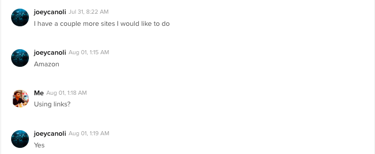

Problem Statement :

To make an Amazon bot that automaticaly buys the product just from the link shared by the user. It also contains a price tracking functionality and the bot buys
the product only when the current price is lower than the target price.

Tools used :

Language - Python
Libraries - Selenium, BeautifulSoup
Browser - Firefox
